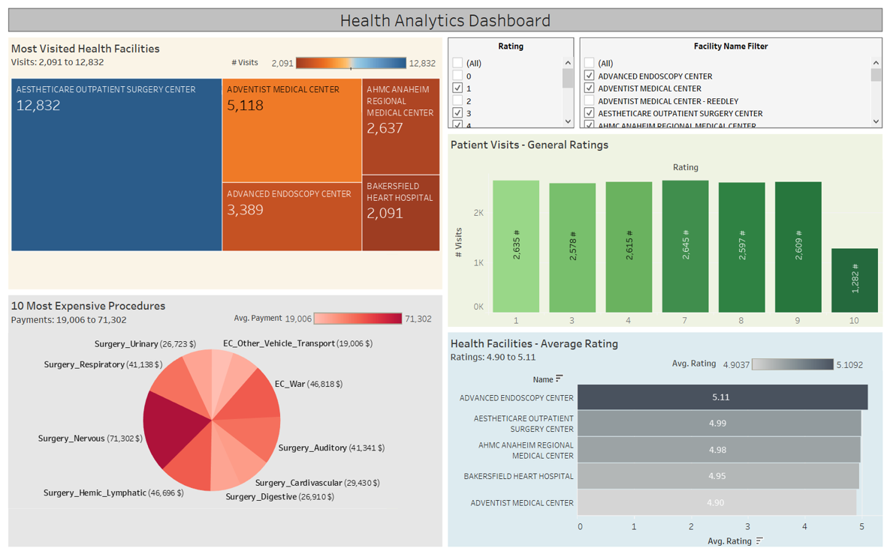
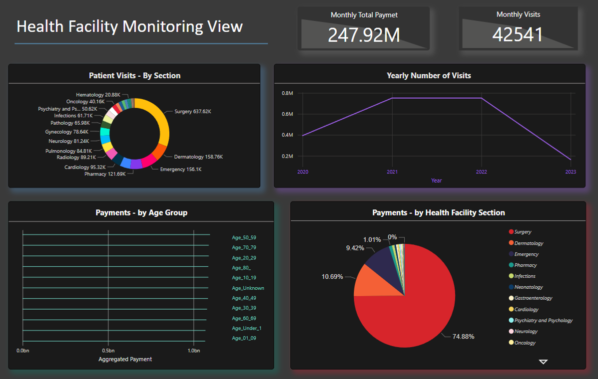
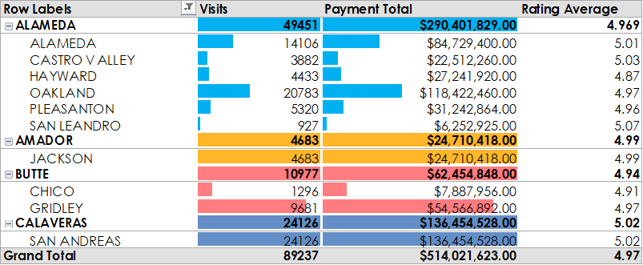

<!-- PROJECT SHIELDS -->
<a name="readme-top"></a>
[![Contributors][contributors-shield]][contributors-url]
[![Forks][forks-shield]][forks-url]
[![Stargazers][stars-shield]][stars-url]
[![Issues][issues-shield]][issues-url]
[![MIT License][license-shield]][license-url]
[![LinkedIn][linkedin-shield]][linkedin-url]


# HF-Analytics
An OLAP system storing data constructed from statistical datasets, research, knowledge base, and data generation techniques for analyzing and building dashboards and reports. 

With patient feedback on the execution of various procedures connected to the treatment of injuries, diagnosis, the prescription of medications by medical professionals, and other procedures, this system can help in getting insight into the effectiveness of the medical facility's operations. General trends in visits number fluctuations, rating declines, and cost charge elevations can be quickly detected and taken care of.

<!-- TABLE OF CONTENTS -->
<details>
  <summary>Table of Contents</summary>
  <ol>
    <li>
      <a href="#about-the-project">About The Project</a>
    </li>
    <li>
      <a href="#getting-started">Getting Started</a>
      <ul>
        <li><a href="#prerequisites">Prerequisites</a></li>
        <li><a href="#installation-and-setup">Installation and Setup</a></li>
        <li><a href="#dashboards">Dashboards</a></li>
        <li><a href="#analysis-reports">Analysis Reports</a></li>
      </ul>
    </li>
    <li>
      <a href="#data-and-research">Data and Research</a>
      <ul>
        <li><a href="#statistical-data">Statistical Data</a></li>
        <li><a href="#research---mayo-clinic">Research - Mayo Clinic</a></li>
        <li><a href="#research---medline-plus">Research - Medline Plus</a></li>
      </ul>
    </li>
    <li><a href="#extras">Extras</a></li>
    <li><a href="#references">References</a></li>
    <li><a href="#contributing">Contributing</a></li>
    <li><a href="#license">License</a></li>
    <li><a href="#contact">Contact</a></li>
  </ol>
</details>


## About The Project
In this Project, we attempt to generate transactional dataset to use as initial data for the OLTP database in PostgreSQL, which we would then transform and load into an OLAP database for health analytics and analysis reports. 

`Languages`: Python, SQL, R

`Tools`: PostgreSQL, Tableau, Power BI, Jupiter, Excel

`Frameworks`: Dash

--> Architecture built for the project:


--> The main dashboards created for this project using Tableau, Power BI, and Dash are showcased in the images below:
<p float="left" align="center">
  
  
  
  
</p>

<br/>

--> Some screenshots of reports built in excel are showcased in the images below:
<p float="left" align="center">
  
  
  
</p>

<p float="left" align="center">
  
  
  
</p>

<p align="right">(<a href="#readme-top">back to top</a>)</p>

<!-- GETTING STARTED -->
## Getting Started

### Prerequisites
before starting with setting up the system, following prerequisites should be fulfilled based on what you want to implement in this project:
* PostgreSQL installed (+ postgres user setup)
* Python (ver. 3.10)
* Windows Device (Tableau Desktop and Power BI Desktop are only available on windows)
* Jupyter environment (for running IPython notebooks)
* R and R studio installed (for running R notebook)
* Power BI and Tableau (for building or viewing dashboards)

### Installation and Setup

1. Packages and Dependancies
    1. pip install -r `requirements.txt`
2. Database Creation (for OLTP and OLAP setup)
    1. login to psql (as `postgres`)
    2. write these two commands:
    ```PostgreSQL
    CREATE DATABASE hospital_oltp_db;
    CREATE DATABASE hospital_olap_db;
    ```
3. Setting Up OLTP Database
    1. open `Data_Modeling_OLTP.ipynb` in `/Notebooks` directory
    2. make sure `statistical_data.xlsx` is in `/Data` directory
    3. in notebook, configure your password for postgres 
    4. run notebook
4. Setting Up OLAP Database
    1. open `Data_Modeling_OLTP.ipynb` in `/Notebooks` directory
    2. configure your password for postgres 
    3. run notebook
5. try running `Python_analysis_work` in `/Notebooks` directory
    * configure your password for postgres 
    
### Dashboards
To get started on building dashboards using Tableau, Power BI, or Dash, follow these steps:
* Tableau
    1. install Tableau Desktop
    2. set your data source connection to PostgresSQL database (`hospital_olap_db`)
    3. connect, and start building your own dashboard using data from OLAP system
    4. (**optional**) import Tableau workbook in the github repo for using the showcased dashboard
* Power BI
    1. install Power BI Desktop
    2. install odbc driver for postgresql in <a href="https://www.postgresql.org/ftp/odbc/versions/msi/">here</a> (based on your postgresql version, and windows archeticture x86 or 64)
    3. install driver
    4. configure the ODBC data source for the PostgreSQL database, open ODBC Data Source (64–bit or 32-bit) 🡪 Click on System DSN tab 🡪 Click on Add
    5. select PostgreSQL Unicode(64 or 32) driver
    6. specify database configuration parameters for the driver
    7. test to verify the connectivity
    8. open Power BI Desktop
    9. choose: Get Data -> Other -> ODBC -> then set your connection parameters for the database
    10. press connect
    11. you are now connected to the data, you can choose to work with it as is or transform your data accordingly to your intended analysis
    12. start building your dashboard
    13. (**optional**) download Power BI workbook <a href="https://drive.google.com/uc?id=1HO5CqUrq_jEUm9D8WPRU35bblEEheFvw&export=download">here</a> and import in Power BI Desktop for using the showcased dashboard
* Dash 
    1. create a virtual environment
    ```
    cd DashApp
    ```
    ```
    py -3 -m venv <venv-name>
    ```
    ```
    <venv-name>\Scripts\activate
    ```
    2. install required dependencies
    ```
    pip install -r dash_requirements.txt
    ```
    3. modify `dashboard.py` script to add your connection configuration parameters
    4. run dashboard: `python dashboard.py`

### Analysis Reports
To get started on writing analysis report using Excel or R, follow these steps:
* Excel
    1. create an excel work
    2. make sure you have installed `ODBC driver` outlined in Power BI setup
    3. choose: Data -> Get Data -> from other sources -> from ODBC -> choose DSN
    4. load/transform your data accordingly to your intended analysis
    5. you can now analyse data in excel
    6. (optional) open excel workbook `Excel_analysis.xlsx` in `/analysis` directory
* R
    1. open R studio 
    2. in R console, install the following:   
    ```R 
    install.packages("languageserver")
    install.packages("knitr")
    install.packages("tidyverse")
    install.packages('RPostgreSQL')
    ```
    3. open R_analysis_report.Rmd in `/notebooks` directory 
    4. configure password for your database connection
    5. modify the notebook for your intended analysis

<p align="right">(<a href="#readme-top">back to top</a>)</p>


<!-- Data and Sources-->
## Data and Research

### Statistical Data 
`Link ->` (<a href="https://data.world/chhs/18072f74-ae01-4d78-97ec-15fee6329c74">data.world</a>)

This data contains summary data of the patients treated in each hospital-based and freestanding Ambulatory Surgery Clinic licensed by the California Department of Public Health (CDPH). It includes information for discharge disposition, expected payer, preferred language spoken, age groups, race groups, sex, principal diagnosis groups, principal procedure groups, and principal external cause of injury/morbidity groups. The data can also be summarized statewide or for a specific facility county, type of control, and/or type of license (hospital or clinic).

### Research - Mayo Clinic 
`Mayo Clinic` is a nonprofit organization committed to clinical practice, education and research, providing expert, whole-person care to everyone who needs healing.
Mayo Clinic’s knowledge base of doctors, department, and specialization directories were utilized to enrich the data sources and related to for building transactional data of patient procedures and employee information.

### Research - Medline Plus
`MedlinePlus` is a service of the National Library of Medicine (NLM), the world's largest medical library, which is part of the National Institutes of Health (NIH). It presents high-quality, relevant health and wellness information that is trusted, easy to understand, and free of advertising, in both English and Spanish. Anywhere, anytime, on any device for free.

Research was done on diseases and treatments outlined in the data sources for building relevant description, cost, and catalogue for each and every procedure, which would help construct the transactional data that is loaded into the OLTP database. 

<p align="right">(<a href="#readme-top">back to top</a>)</p>


<!-- EXTRAS -->
## Extras
if you want to build databases with sql scripts instead of running python notebooks, check `Extras/SQL_Scripts` directory, it contains scripts for creating tables, inserting data, composing views, indices, roles and user assignments, in addition to sql queries for some of the analysis conducted in R and python analysis notebooks.

To directly check the HTML reports built in Python and R, open `Python_work.html` or `R_analysis_report.html` in `/Analysis` directory.

Some of the perfomance analytics for the `pgadmin4` user interface is uploaded as pictures in `Extras` directory. 

There is also a file containing the link for original data used for this project - `Extras/links.txt`, as well links for sources of research conducted while building the transactional data. 

To see the work for making the access control and permission for different roles in PostgreSQL, check the workbook `Extras/database_permissions.xlsx`.

<p align="right">(<a href="#readme-top">back to top</a>)</p>


## References 
links utilized in the making of this project: 

`[1]` https://www.sisense.com/glossary/healthcare-analytics-basics/

`[2]` https://www.coursera.org/articles/healthcare-analytics

`[3]` https://www.ibm.com/topics/healthcare-analytics

`[4]` https://medlineplus.gov/healthtopics.html

`[5]` https://www.mayoclinic.org/diseases-conditions

`[6]` https://www.mayoclinic.org/tests-procedures

`[7]` https://data.world/chhs/18072f74-ae01-4d78-97ec-15fee6329c74

<p align="right">(<a href="#readme-top">back to top</a>)</p>

<!-- CONTRIBUTING -->
## Contributing
1. Fork the Project
2. Create your Feature Branch (`git checkout -b feature/AmazingFeature`)
3. Commit your Changes (`git commit -m 'Add some AmazingFeature'`)
4. Push to the Branch (`git push origin feature/AmazingFeature`)
5. Open a Pull Request

<p align="right">(<a href="#readme-top">back to top</a>)</p>


<!-- LICENSE -->
## License

Distributed under the Apache License 2.0. See `LICENSE` for more information.

<p align="right">(<a href="#readme-top">back to top</a>)</p>
  
 
<!-- CONTACT -->
## Contact

Mohammad Almasri - [@linkedin](https://www.linkedin.com/in/mohammad-almasri-964867197/) - modaj18@gmail.com

<p align="right">(<a href="#readme-top">back to top</a>)</p>


<!-- MARKDOWN LINKS & IMAGES -->
<!-- https://www.markdownguide.org/basic-syntax/#reference-style-links -->
[contributors-shield]: https://img.shields.io/github/contributors/MODAJ18/HF-Analytics.svg?style=for-the-badge
[contributors-url]: https://github.com/MODAJ18/HF-Analytics/graphs/contributors
[forks-shield]: https://img.shields.io/github/forks/MODAJ18/HF-Analytics.svg?style=for-the-badge
[forks-url]: https://github.com/MODAJ18/HF-Analytics/network/members
[stars-shield]: https://img.shields.io/github/stars/MODAJ18/HF-Analytics.svg?style=for-the-badge
[stars-url]: https://github.com/MODAJ18/HF-Analytics/stargazers
[issues-shield]: https://img.shields.io/github/issues/MODAJ18/HF-Analytics.svg?style=for-the-badge
[issues-url]: https://github.com/MODAJ18/HF-Analytics/issues
[license-shield]: https://img.shields.io/github/license/MODAJ18/HF-Analytics.svg?style=for-the-badge
[license-url]: https://github.com/MODAJ18/HF-Analytics/blob/master/License
[linkedin-shield]: https://img.shields.io/badge/-LinkedIn-black.svg?style=for-the-badge&logo=linkedin&colorB=555
[linkedin-url]: https://www.linkedin.com/in/mohammad-almasri-964867197/


